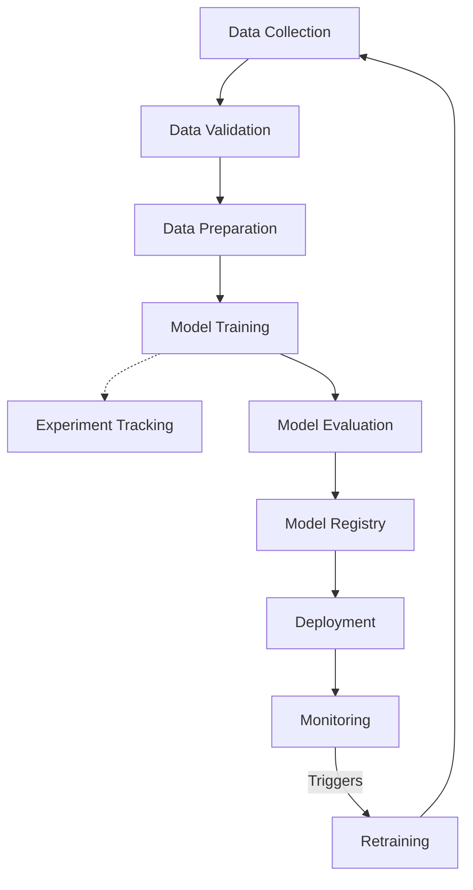

# Assignment 1: Software Engineering with ML FlowLab

**Name:** Abhinav Mishra
**Roll No:** 24AI004

## Part A – Understanding MLOps

### Activity 1: Key Concepts

**What is MLOps?**
MLOps (Machine Learning Operations) is a set of practices that combines Machine Learning, DevOps, and Data Engineering to deploy and maintain ML systems in production reliably and efficiently. It aims to automate and streamline the ML lifecycle.

**Why do ML projects fail in production? ML Lifecycle**
Projects often fail due to:
- Lack of reproducibility in data and models.
- Training-serving skew (differences between training and production environments).
- Model drift (degradation of model performance over time as real-world data changes).
- Siloed teams (data scientists vs. software engineers).

The ML Lifecycle involves continuous loops of Data Preparation, Model Training, Evaluation, Deployment, and Monitoring.

**DevOps vs DataOps vs MLOps**
- **DevOps**: Focuses on automating software delivery and infrastructure changes (code, build, test, release).
- **DataOps**: Focuses on data quality, data integration, and reducing the cycle time of data analytics.
- **MLOps**: Extends DevOps and DataOps to include ML-specific challenges like model versioning, continuous training, and monitoring model drift.

**CI, CD, CT**
- **Continuous Integration (CI)**: Automating the testing and validation of code and data.
- **Continuous Deployment/Delivery (CD)**: Automating the deployment of the model to a production environment.
- **Continuous Training (CT)**: Automating the retraining of ML models as new data becomes available.

**Model Monitoring**
Tracking the performance of deployed models to ensure they still meet business objectives. This includes monitoring for data drift, concept drift, and system metrics (latency, memory).

**Model Registry**
A centralized repository to store, version, and manage ML models. It tracks model lineage, metadata, and transitions through stages (e.g., Staging to Production).

### Activity 2: MLOps Lifecycle Diagram

Here is a representation of the MLOps Lifecycle:

##  Exploring MLflow

### Observations from `mlflow ui`
When running `mlflow ui` and opening the interface (usually at `http://127.0.0.1:5000`):
- **Experiments**: Listed on the left sidebar. The default experiment is typically named "Default" (ID: 0). You can create new experiments to group related runs.
- **Runs**: Displayed in a tabular format within an experiment. Each run represents a single execution of a model training script.
- **Artifacts**: A section within a run's details page showing output files like saved models, plots (e.g., ROC curves), or data files logged during the run.
- **Parameters**: Key-value pairs (e.g., learning rate, batch size) used to configure the run, making it easy to compare different configurations.
- **Metrics**: Quantitative values updated during the run (e.g., accuracy, loss) used to evaluate and compare model performance.

7. **Which companies are using MLflow?**
   Many prominent tech companies and enterprises use MLflow, including Databricks (its creator), Microsoft, Toyota, Zillow, and numerous others adopting modern MLOps practices.
