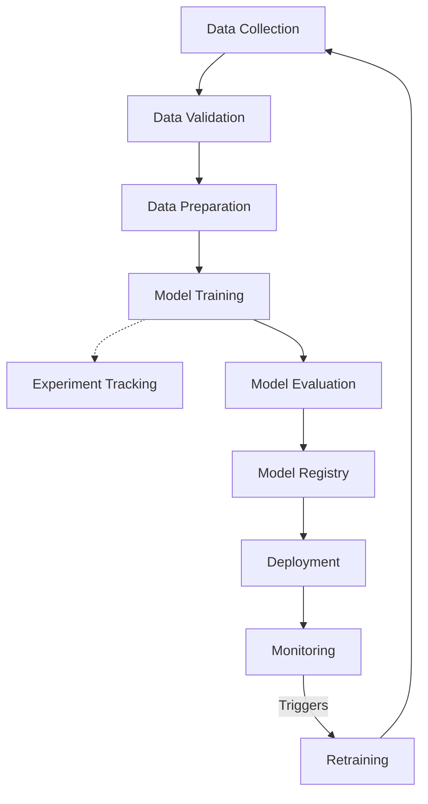

# Assignment 1: Software Engineering with ML FlowLab

**Name:** Abhinav Mishra
**Roll No:** 24AI004

## Part A – Understanding MLOps

### Activity 1: Key Concepts

**What is MLOps?**
MLOps (Machine Learning Operations) is a set of practices that combines Machine Learning, DevOps, and Data Engineering to deploy and maintain ML systems in production reliably and efficiently. It aims to automate and streamline the ML lifecycle.

**Why do ML projects fail in production? ML Lifecycle**
Projects often fail due to:
- Lack of reproducibility in data and models.
- Training-serving skew (differences between training and production environments).
- Model drift (degradation of model performance over time as real-world data changes).
- Siloed teams (data scientists vs. software engineers).

The ML Lifecycle involves continuous loops of Data Preparation, Model Training, Evaluation, Deployment, and Monitoring.

**DevOps vs DataOps vs MLOps**
- **DevOps**: Focuses on automating software delivery and infrastructure changes (code, build, test, release).
- **DataOps**: Focuses on data quality, data integration, and reducing the cycle time of data analytics.
- **MLOps**: Extends DevOps and DataOps to include ML-specific challenges like model versioning, continuous training, and monitoring model drift.

**CI, CD, CT**
- **Continuous Integration (CI)**: Automating the testing and validation of code and data.
- **Continuous Deployment/Delivery (CD)**: Automating the deployment of the model to a production environment.
- **Continuous Training (CT)**: Automating the retraining of ML models as new data becomes available.

**Model Monitoring**
Tracking the performance of deployed models to ensure they still meet business objectives. This includes monitoring for data drift, concept drift, and system metrics (latency, memory).

**Model Registry**
A centralized repository to store, version, and manage ML models. It tracks model lineage, metadata, and transitions through stages (e.g., Staging to Production).

### Activity 2: MLOps Lifecycle Diagram

Here is a representation of the MLOps Lifecycle:


*(You can use the diagram above in your final submission, or recreate it in Draw.io/Canva).*

## Part B – Development Environment Setup

To verify installations and take screenshots, run the following commands in your terminal:

```bash
python --version
git --version
code --version
docker --version
mlflow --version
```
*(Please take screenshots of the output for your submission).*

## Part C – Create Your First MLOps Project

The project structure has been created successfully in the `MLOps-Lab` folder. 
To push it to GitHub, please follow these steps in your terminal:
1. Go to GitHub and create a new empty repository named `MLOps-Lab`.
2. Ensure you are in the `MLOps-Lab` directory.
3. Run the following commands:
```bash
git add .
git commit -m "Initial commit: Set up MLOps project structure"
git branch -M main
git remote add origin <YOUR_GITHUB_REPO_URL>
git push -u origin main
```

## Part D – Exploring MLflow

### Observations from `mlflow ui`
When running `mlflow ui` and opening the interface (usually at `http://127.0.0.1:5000`):
- **Experiments**: Listed on the left sidebar. The default experiment is typically named "Default" (ID: 0). You can create new experiments to group related runs.
- **Runs**: Displayed in a tabular format within an experiment. Each run represents a single execution of a model training script.
- **Artifacts**: A section within a run's details page showing output files like saved models, plots (e.g., ROC curves), or data files logged during the run.
- **Parameters**: Key-value pairs (e.g., learning rate, batch size) used to configure the run, making it easy to compare different configurations.
- **Metrics**: Quantitative values updated during the run (e.g., accuracy, loss) used to evaluate and compare model performance.

*(Please take screenshots of the MLflow UI as required).*

### Challenge Activity

1. **Why is MLflow called an "experiment tracking" platform?**
   It allows data scientists to log, organize, and compare parameters, code versions, metrics, and artifacts across hundreds of training iterations (experiments) to quickly identify the best performing model.

2. **What problems does MLflow solve?**
   It solves the lack of reproducibility, difficulty in tracking hyperparameter tuning, challenges in model packaging for deployment, and the absence of a centralized model registry.

3. **Can MLflow be used with TensorFlow?**
   Yes, MLflow has built-in autologging (`mlflow.tensorflow.autolog()`) and APIs for logging TensorFlow/Keras models seamlessly.

4. **Can MLflow be used with PyTorch?**
   Yes, MLflow supports PyTorch natively, allowing for logging PyTorch models, metrics, and integrating with PyTorch Lightning.

5. **Can MLflow be used with Scikit-Learn?**
   Yes, it has strong integration with Scikit-Learn, including native autologging capabilities (`mlflow.sklearn.autolog()`).

6. **Can MLflow be deployed using Docker?**
   Yes, MLflow models can be containerized. MLflow can automatically build a Docker image containing the model and its dependencies. Also, the tracking server itself is frequently hosted in a Docker container.

7. **Which companies are using MLflow?**
   Many prominent tech companies and enterprises use MLflow, including Databricks (its creator), Microsoft, Toyota, Zillow, and numerous others adopting modern MLOps practices.
